# 🏥 Hospital Management System


A production-style **Spring Boot REST API** for managing **Patients, Doctors, Appointments, and Authentication** in a secure, role-based environment.

Built to demonstrate modern backend development practices using **Java 17**, **Spring Boot**, **Spring Security (JWT)**, **MySQL**, **Docker**, **Flyway**, and comprehensive **Unit & Integration Testing**.

## 🚀 Highlights

- JWT Authentication & Role-Based Authorization
- Patient, Doctor & Appointment Management
- RESTful APIs documented with Swagger / OpenAPI
- MySQL with Flyway Database Versioning
- Dockerized Application with Docker Compose
- Unit & Integration Testing (JUnit 5, Mockito, MockMvc)
- Pagination, Sorting & Dynamic Filtering
- Global Exception Handling & Request Validation
- Ready-to-import Postman Collection for API testing

---

## Table of Contents

- [Overview](#overview)
- [Features](#features)
- [Architecture](#architecture)
- [Tech Stack](#tech-stack)
- [API Documentation](#api-documentation)
- [Screenshots](#screenshots)
- [Getting Started](#getting-started)
- [Environment Variables](#environment-variables)
- [Running with Docker 🐳](#running-with-docker) 
- [Running Locally](#running-locally)
- [Testing](#testing) 
- [Future Improvements](#future-improvements)
- [Author](#author)

---

## Overview

Hospital Management System is a production-style backend application built with **Spring Boot** that provides secure REST APIs for managing patients, doctors, appointments, and user authentication.

The project follows a **layered architecture** with clear separation of concerns using Controllers, Services, Repositories, DTOs, and Entities. It demonstrates modern backend development practices including **JWT-based authentication**, **role-based authorization**, **input validation**, **global exception handling**, **pagination**, **dynamic filtering**, **database versioning with Flyway**, **Dockerized deployment**, and **comprehensive unit and integration testing**.

The primary goal of this project is to showcase the design and implementation of a scalable, maintainable, and production-ready backend application using the Spring ecosystem.

---
<p align="right">(<a href="#table-of-contents">Back to top ↑</a>)</p>

## Features

### Authentication & Authorization

- JWT-based authentication
- Role-based access control (ADMIN, DOCTOR, RECEPTIONIST)
- Secure password hashing using BCrypt
- Protected REST endpoints with Spring Security

### Patient Management

- Create, update, retrieve and delete patients
- Dynamic filtering using Spring Data JPA Specifications
- Pagination and sorting support
- Request validation with meaningful error responses

### Doctor Management

- Create, update, retrieve and delete doctors
- Doctor specialization management
- Pagination and sorting support

### Appointment Management

- Schedule appointments between patients and doctors
- Prevent duplicate appointment bookings
- Complete, cancel and reschedule appointments
- Appointment status management

### API Design

- RESTful API design
- Request/Response DTO pattern
- Centralized global exception handling
- Consistent API response structure

### Database

- MySQL database
- Spring Data JPA (Hibernate)
- Flyway database versioning

### Testing Coverage

- Unit testing with JUnit 5 and Mockito
- Integration testing using MockMvc
- Authentication and authorization test coverage
- Service layer and API endpoint testing

### DevOps & Tooling

- Dockerized application
- Docker Compose for local development
- OpenAPI / Swagger documentation
- Environment variable configuration using `.env`

---
<p align="right">(<a href="#table-of-contents">Back to top ↑</a>)</p>

## Architecture

**Contents**
- [High-Level Architecture](#high-level-architecture)
- [Layered Architecture](#layered-architecture)
- [Request Flow](#request-flow)
- [JWT Authentication Flow](#jwt-authentication-flow)
- [Source Code Organization](#source-code-organization)
- [Database ER Diagram](#database-er-diagram)

The Hospital Management System follows a layered architecture to promote separation of concerns, maintainability, and scalability. Each layer has a single responsibility, making the application easier to test, extend, and maintain.

The diagrams below provide a high-level overview of the application's architecture, request lifecycle, security flow, project organization, and database design.

### High-Level Architecture

> Shows how an HTTP request flows through the application from the client to the database and back.

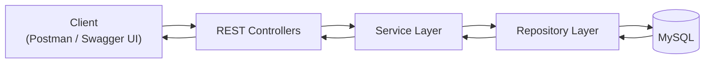

---

### Layered Architecture

> Illustrates the responsibilities of each application layer.

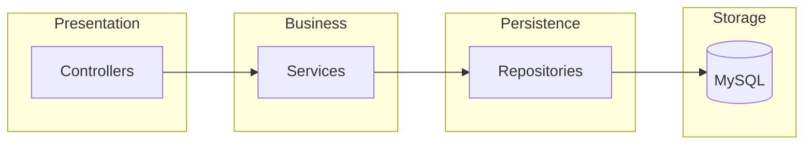

---

### Request Flow

> Example lifecycle of a typical API request.

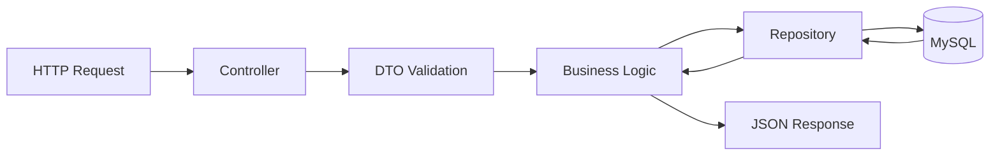

---

### JWT Authentication Flow

The application secures protected endpoints using Spring Security and JWT authentication. After a successful login, every incoming request passes through the custom authentication filter before reaching the controller.

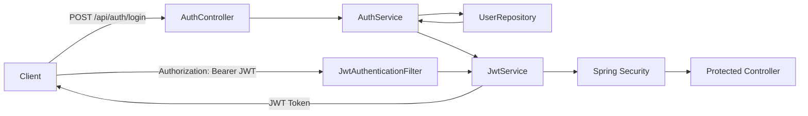

---

### Source Code Organization

> High-level organization of the source code.

```text
src
├── main
│   ├── java/com/jana/hospital_management
│   │
│   ├── config/                 # Swagger / OpenAPI configuration
│   │
│   ├── controller/             # REST Controllers
│   │   ├── AuthController
│   │   ├── PatientController
│   │   ├── DoctorController
│   │   └── AppointmentController
│   │
│   ├── dto/                    # Request & Response DTOs
│   │
│   ├── entity/                 # JPA Entities & Enums
│   │   ├── Patient
│   │   ├── Doctor
│   │   ├── Appointment
│   │   └── User
│   │
│   ├── repository/             # Spring Data JPA Repositories
│   │
│   ├── service/                # Business Logic
│   │
│   ├── security/               # JWT & Spring Security
│   │
│   ├── specification/          # Dynamic Filtering
│   │
│   └── exception/              # Global Exception Handling
│
│   └── resources
│       ├── application.properties
│       └── db/migration
│           └── V1__initial_schema.sql
│
└── test
    ├── integration/            # Integration Tests
    ├── service/                # Unit Tests
    └── application-test.properties
```

---

### Database ER Diagram

> Entity relationships used by the application.

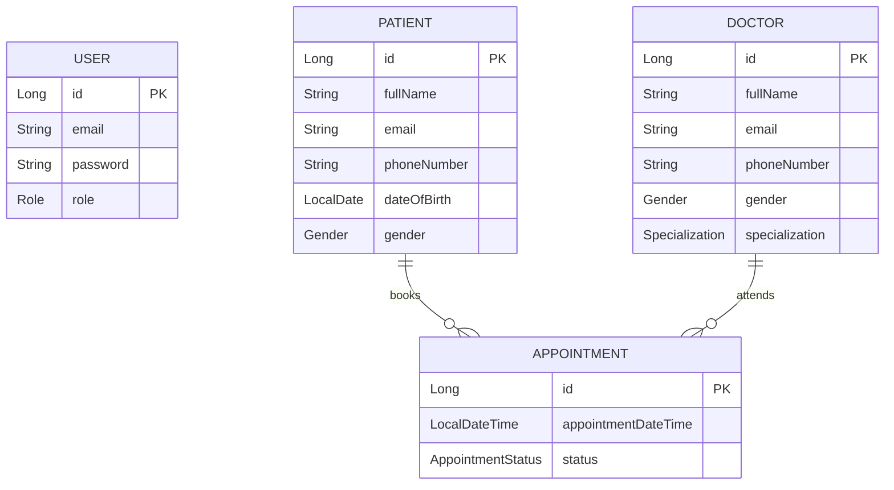
<p align="right">(<a href="#table-of-contents">Back to top ↑</a>)</p>

## Tech Stack

| Category | Technologies                |
|----------|-----------------------------|
| Language | Java 17                     |
| Framework | Spring Boot 3.5             |
| Build Tool | Maven                       |
| Database | MySQL 8                     |
| ORM | Spring Data JPA (Hibernate) |
| Security | Spring Security, JWT        |
| Validation | Jakarta Bean Validation     |
| API Documentation | Swagger / OpenAPI           |
| Database Migration | Flyway                      |
| Testing | JUnit 5, Mockito, MockMvc   |
| Containerization | Docker, Docker Compose      |
| Version Control | Git, GitHub                 |
<p align="right">(<a href="#table-of-contents">Back to top ↑</a>)</p>

## API Documentation

The REST APIs are documented using **Swagger / OpenAPI**.

Once the application is running, the documentation can be accessed at:

| Tool | URL |
|------|-----|
| Swagger UI | `http://localhost:8080/swagger-ui/index.html` |
| OpenAPI Specification | `http://localhost:8080/v3/api-docs` |

### Authentication

Protected endpoints require a JWT access token.

1. Login using `POST /api/auth/login`.
2. Copy the returned JWT token.
3. Click the **Authorize** button in Swagger UI.
4. Enter the token in the following format:

```text
Bearer <your-jwt-token>
```

After authorization, all protected endpoints can be tested directly from Swagger UI.

<p align="right">(<a href="#table-of-contents">Back to top ↑</a>)</p>

## Screenshots

The following screenshots demonstrate the application's key features and verify that the backend is fully functional.

### Swagger UI

Interactive API documentation generated using OpenAPI / Swagger.

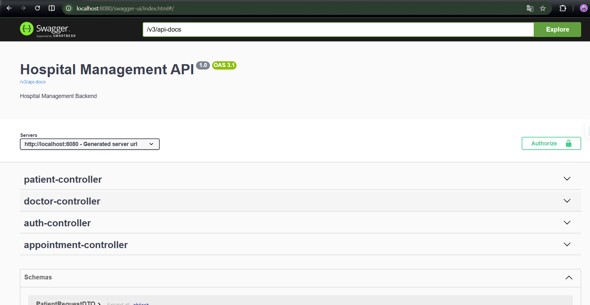

---

### JWT Authentication

Authenticating through Swagger using a JWT Bearer Token.

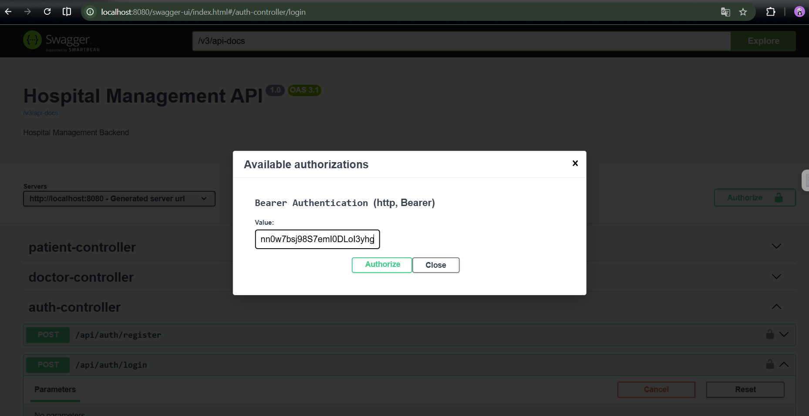

---

### Login API

Successful authentication returning a JWT token.

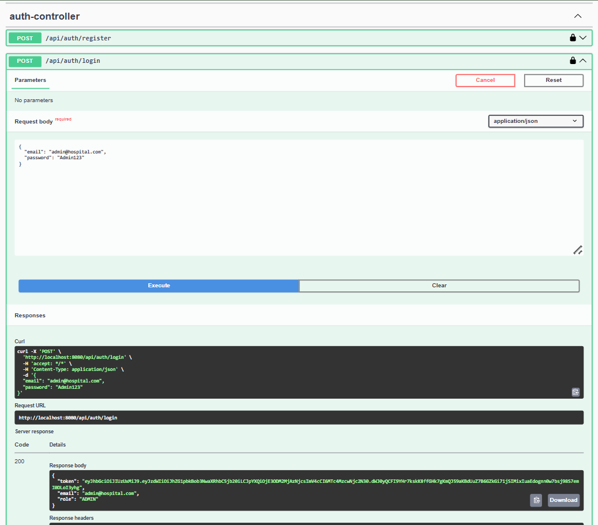

---

### Create Patient

Creating a new patient through a protected endpoint.

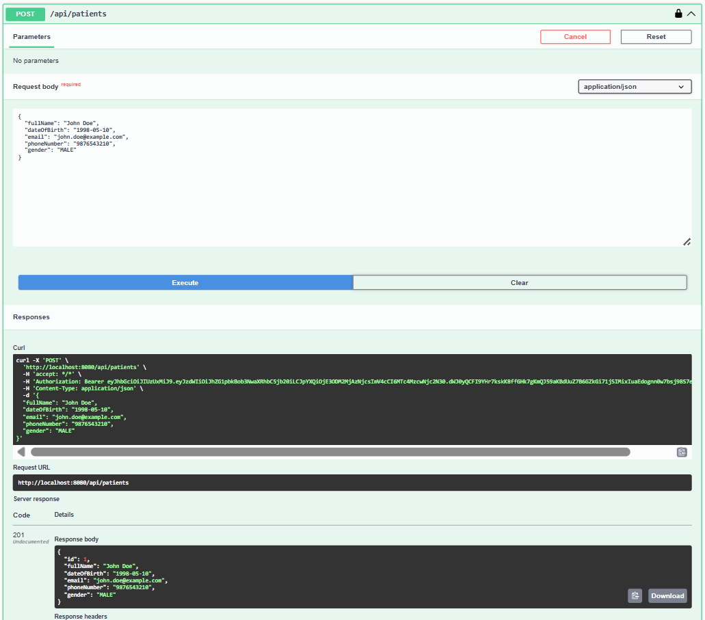

---

### Validation Error Handling

Example of request validation with a structured error response.

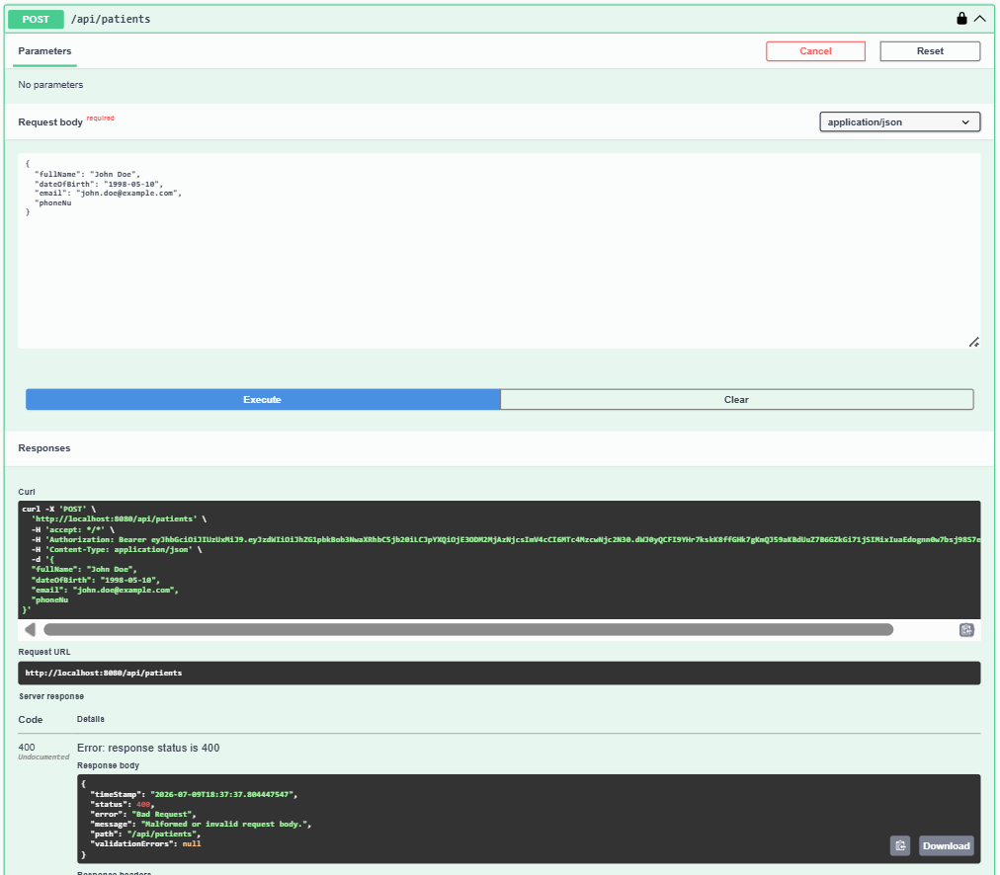

---

### Docker Containers

Application and MySQL running successfully using Docker Compose.

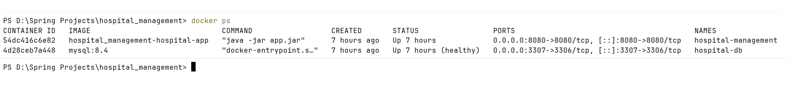

---

### Automated Tests

All unit and integration tests passing successfully.

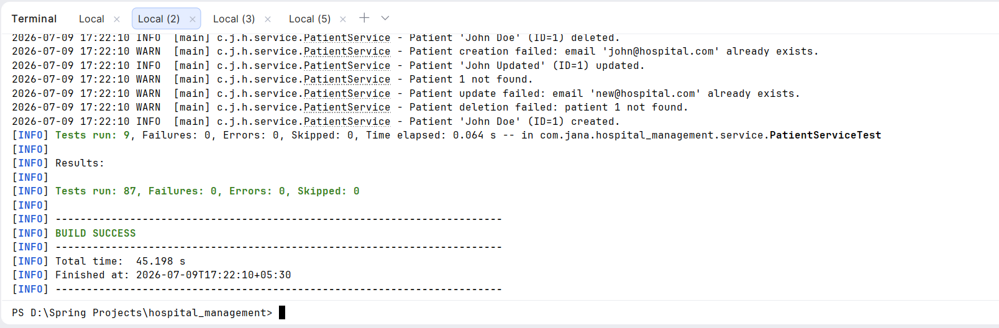

<p align="right">(<a href="#table-of-contents">Back to top ↑</a>)</p>

## Getting Started

Follow the steps below to set up and run the project.

### Prerequisites

Install the following tools before getting started:

- Java 17
- Maven 3.9+
- Git
- Docker & Docker Compose (recommended)

Clone the repository:

```bash
git clone https://github.com/DipuJana/hospital_management.git

cd hospital_management
```

### Using the Postman Collection

A ready-to-use Postman Collection is included in the repository.

```
postman/
└── HospitalManagementAPI.postman_collection.json
```

To use it:

1. Open Postman.
2. Click **Import**.
3. Select `HospitalManagementAPI.postman_collection.json`.
4. Start the application locally.
5. Run the **Login** request to obtain a JWT token.
6. Set the `jwtToken` collection variable
7. Test the remaining API endpoints.

<p align="right">(<a href="#table-of-contents">Back to top ↑</a>)</p>

## Environment Variables

The project uses environment variables to avoid hardcoding sensitive information.

Copy the example configuration:

```bash
cp .env.example .env
```

or on Windows:

```cmd
copy .env.example .env
```

Update the values in the `.env` file as needed.

Example:

```properties
SPRING_DATASOURCE_URL=jdbc:mysql://localhost:3307/hospital_management

SPRING_DATASOURCE_USERNAME=root

SPRING_DATASOURCE_PASSWORD=your_database_password

JWT_SECRET=replace_with_a_secure_random_secret_key
```

> **Note**
>
> The `.env` file is ignored by Git and should never be committed.

<p align="right">(<a href="#table-of-contents">Back to top ↑</a>)</p>

## Running with Docker

The easiest way to run the application is with Docker Compose.

### Build and start the containers

```bash
docker compose up --build
```

To run the containers in the background:

```bash
docker compose up -d
```

Stop the application:

```bash
docker compose down
```

The application will be available at:

```
http://localhost:8080
```

Swagger UI:

```
http://localhost:8080/swagger-ui/index.html
```

Verify the running containers:

```bash
docker ps
```

> See the **Docker Containers** screenshot above for an example of a successful deployment.

<p align="right">(<a href="#table-of-contents">Back to top ↑</a>)</p>

## Running Locally

If you prefer not to use Docker, you can run the application directly with Maven.

1. Configure your `.env` file.
2. Make sure MySQL is running and the database exists.
3. Start the application:

```bash
./mvnw spring-boot:run
```

On Windows:

```cmd
mvnw.cmd spring-boot:run
```

The application will be available at:

```
http://localhost:8080
```

Swagger UI:

```
http://localhost:8080/swagger-ui/index.html
```

<p align="right">(<a href="#table-of-contents">Back to top ↑</a>)</p>

## Testing

The project includes **87 automated tests** to ensure the correctness, reliability, and security of the application. Both unit and integration tests are used to verify business logic, REST APIs, authentication, validation, and exception handling.

### Run Unit Tests

```bash
./mvnw test
```

### Run All Tests

```bash
./mvnw verify
```

### Test Coverage

- Service Layer Unit Tests
- REST API Integration Tests
- JWT Authentication & Authorization
- Request Validation
- Global Exception Handling
- CRUD Operations
- Appointment Scheduling Rules

<p align="right">(<a href="#table-of-contents">Back to top ↑</a>)</p>

## Future Improvements

Possible enhancements for future iterations include:

- Doctor availability management
- Patient medical history & prescriptions
- File upload for medical reports
- CI/CD pipeline with GitHub Actions
- Cloud deployment (AWS / Render)

<p align="right">(<a href="#table-of-contents">Back to top ↑</a>)</p>

## Author

**Dipanjan Jana**

- GitHub: https://github.com/DipuJana
- LinkedIn: https://www.linkedin.com/in/dipanjan-jana-96ba2827a/

If you found this project useful or have suggestions for improvement, feel free to open an issue or connect with me.

<p align="right">(<a href="#table-of-contents">Back to top ↑</a>)</p>
